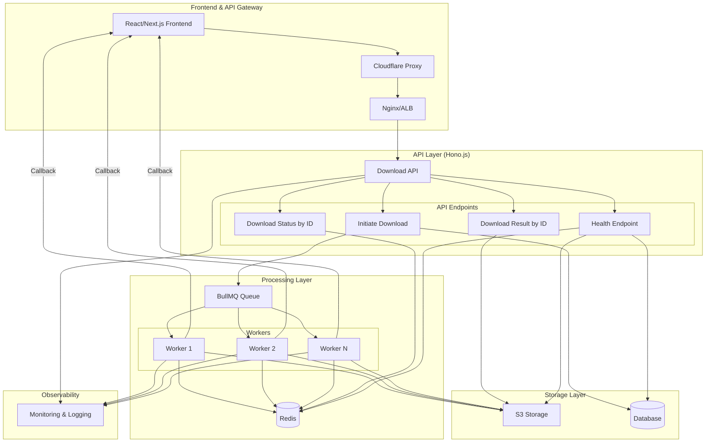
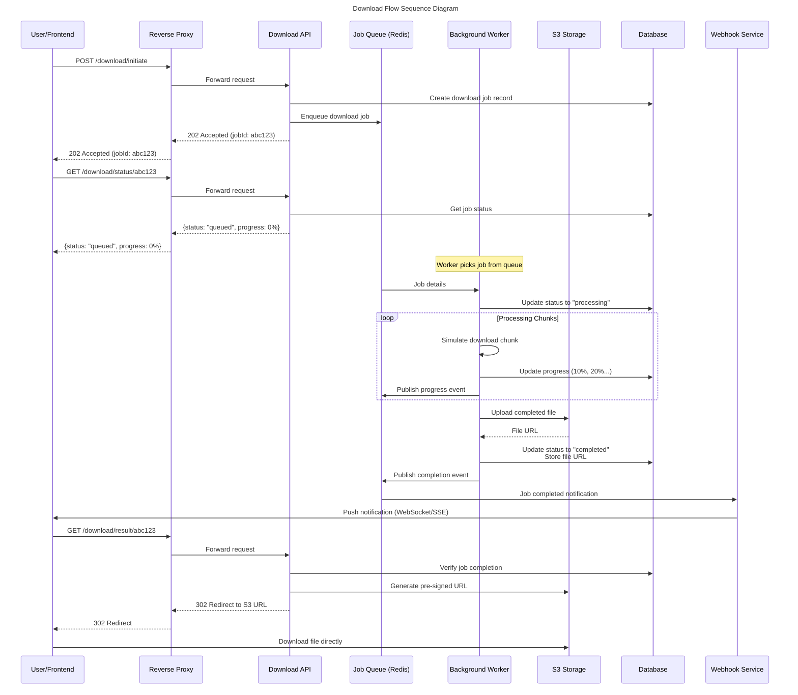

# Long-Running Download Architecture Design

## The Problem

This microservice handles file downloads with highly variable processing times (10-120+ seconds), which creates critical issues when deployed behind reverse proxies:

- **Connection Timeouts**: Proxies like Cloudflare (100s timeout) terminate long HTTP connections
- **Poor User Experience**: Users wait 2+ minutes with no feedback
- **Resource Exhaustion**: Open HTTP connections consume server memory
- **Retry Storms**: Dropped connections lead to duplicate work

## Architecture Overview

Our solution implements a **Hybrid Polling + Background Processing + Webhook Pattern** that decouples the HTTP request/response cycle from the actual download processing.

### System Components

```
┌─────────────────────────────────────────────────────────────────────────┐
│                        Frontend & API Gateway                          │
├─────────────────────────────────────────────────────────────────────────┤
│  React/Next.js Frontend → Cloudflare Proxy → Nginx/ALB → Download API  │
└─────────────────────────────────────────────────────────────────────────┘
                                    │
                                    ▼
┌─────────────────────────────────────────────────────────────────────────┐
│                           API Layer (Hono.js)                          │
├─────────────────────────────────────────────────────────────────────────┤
│  • Download Status by ID    • Initiate Download    • Health Endpoint   │
│  • Download Result by ID    • Webhook Callbacks    • Progress Updates  │
└─────────────────────────────────────────────────────────────────────────┘
                                    │
                                    ▼
┌─────────────────────────────────────────────────────────────────────────┐
│                         Processing Layer                               │
├─────────────────────────────────────────────────────────────────────────┤
│              BullMQ Queue → Worker 1, Worker 2, Worker N               │
└─────────────────────────────────────────────────────────────────────────┘
                                    │
                    ┌───────────────┼───────────────┐
                    ▼               ▼               ▼
┌─────────────────┐ ┌─────────────────┐ ┌─────────────────┐
│  Observability  │ │  Storage Layer  │ │    Database     │
│ Monitoring &    │ │   S3 Storage    │ │   Job Status    │
│   Logging       │ │                 │ │   & Metadata    │
└─────────────────┘ └─────────────────┘ └─────────────────┘
```

### System Workflow Diagram



## Technical Approach: Hybrid Pattern
### Core Flow

1. **Immediate Response**: Client gets `jobId` instantly (< 100ms)
2. **Background Processing**: Workers handle long-running downloads asynchronously
3. **Status Polling**: Client polls for updates every 2-5 seconds
4. **Webhook Notifications**: Optional real-time updates via WebSocket/SSE
5. **Direct Download**: Pre-signed S3 URLs for completed files

### Sequence Diagram Implementation

```
User/Frontend → POST /download/initiate
                ↓
            202 Accepted (jobId: abc123)
                ↓
            GET /download/status/abc123 (poll every 3s)
                ↓
            {"status": "queued", "progress": 0%}
                ↓
        Worker picks job from queue
                ↓
            {"status": "processing", "progress": 45%}
                ↓
        [Processing Chunks] → Update progress
                ↓
            {"status": "completed", "fileUrl": "s3://..."}
                ↓
            GET /download/result/abc123
                ↓
            302 Redirect to S3 URL
                ↓
        Download file directly from S3
```

### Sequence Diagram



## API Contract Changes
### New Endpoints

```typescript
// 1. Initiate Download (Enhanced)
POST /v1/download/initiate
{
  "file_ids": [70000, 80000],
  "webhook_url": "https://app.example.com/webhooks/download", // Optional
  "callback_metadata": { "user_id": "123", "session": "abc" } // Optional
}
→ 202 Accepted
{
  "job_id": "550e8400-e29b-41d4-a716-446655440000",
  "status": "queued",
  "estimated_completion": "2025-01-15T10:30:00Z",
  "polling_url": "/v1/download/status/550e8400-e29b-41d4-a716-446655440000"
}

// 2. Job Status Polling
GET /v1/download/status/{job_id}
→ 200 OK
{
  "job_id": "550e8400-e29b-41d4-a716-446655440000",
  "status": "processing", // queued, processing, completed, failed
  "progress": 0.65, // 0.0 to 1.0
  "files_completed": 1,
  "files_total": 2,
  "estimated_remaining_ms": 45000,
  "created_at": "2025-01-15T10:25:00Z",
  "updated_at": "2025-01-15T10:28:30Z"
}

// 3. Download Result
GET /v1/download/result/{job_id}
→ 200 OK (if completed)
{
  "job_id": "550e8400-e29b-41d4-a716-446655440000",
  "status": "completed",
  "download_urls": [
    {
      "file_id": 70000,
      "url": "https://s3.amazonaws.com/downloads/70000.zip?X-Amz-Expires=3600&...",
      "expires_at": "2025-01-15T11:30:00Z",
      "size_bytes": 1048576
    }
  ],
  "zip_url": "https://s3.amazonaws.com/downloads/bulk-550e8400.zip?...", // All files
  "expires_at": "2025-01-15T11:30:00Z"
}

// 4. WebSocket/SSE Updates (Optional)
GET /v1/download/subscribe/{job_id}
→ Server-Sent Events stream
data: {"job_id": "...", "status": "processing", "progress": 0.25}
data: {"job_id": "...", "status": "processing", "progress": 0.50}
data: {"job_id": "...", "status": "completed", "download_urls": [...]}
```

## Database Schema

```sql
-- Job tracking table
CREATE TABLE download_jobs (
  id UUID PRIMARY KEY DEFAULT gen_random_uuid(),
  status VARCHAR(20) NOT NULL DEFAULT 'queued', -- queued, processing, completed, failed
  file_ids INTEGER[] NOT NULL,
  progress DECIMAL(3,2) DEFAULT 0.00, -- 0.00 to 1.00
  files_completed INTEGER DEFAULT 0,
  files_total INTEGER NOT NULL,
  webhook_url TEXT,
  callback_metadata JSONB,
  error_message TEXT,
  created_at TIMESTAMP DEFAULT NOW(),
  updated_at TIMESTAMP DEFAULT NOW(),
  completed_at TIMESTAMP,
  expires_at TIMESTAMP DEFAULT (NOW() + INTERVAL '24 hours')
);

-- Individual file processing
CREATE TABLE download_files (
  id UUID PRIMARY KEY DEFAULT gen_random_uuid(),
  job_id UUID REFERENCES download_jobs(id) ON DELETE CASCADE,
  file_id INTEGER NOT NULL,
  status VARCHAR(20) DEFAULT 'pending', -- pending, processing, completed, failed
  s3_key TEXT,
  size_bytes BIGINT,
  processing_started_at TIMESTAMP,
  processing_completed_at TIMESTAMP,
  error_message TEXT
);

-- Indexes for performance
CREATE INDEX idx_download_jobs_status ON download_jobs(status);
CREATE INDEX idx_download_jobs_created_at ON download_jobs(created_at);
CREATE INDEX idx_download_files_job_id ON download_files(job_id);
```

## Background Job Processing

### BullMQ Queue Configuration

```typescript
// Queue setup with Redis
import { Queue, Worker } from 'bullmq';

const downloadQueue = new Queue('download-processing', {
  connection: { host: 'redis', port: 6379 },
  defaultJobOptions: {
    removeOnComplete: 100,
    removeOnFail: 50,
    attempts: 3,
    backoff: { type: 'exponential', delay: 2000 }
  }
});

// Worker implementation
const worker = new Worker('download-processing', async (job) => {
  const { jobId, fileIds } = job.data;
  
  // Update status to processing
  await updateJobStatus(jobId, 'processing');
  
  for (let i = 0; i < fileIds.length; i++) {
    const fileId = fileIds[i];
    
    // Process individual file (simulate long operation)
    await processFileDownload(fileId, jobId);
    
    // Update progress
    const progress = (i + 1) / fileIds.length;
    await updateJobProgress(jobId, progress, i + 1);
    
    // Publish progress event (WebSocket/SSE)
    await publishProgressEvent(jobId, { progress, filesCompleted: i + 1 });
  }
  
  // Generate pre-signed URLs and mark complete
  const downloadUrls = await generatePresignedUrls(jobId);
  await updateJobStatus(jobId, 'completed', { downloadUrls });
  
  // Send webhook notification if configured
  await sendWebhookNotification(jobId);
}, {
  connection: { host: 'redis', port: 6379 },
  concurrency: 5 // Process 5 jobs simultaneously
});
```

## Error Handling & Retry Logic

### Timeout Configuration Layers

```typescript
// 1. API Layer Timeouts (Fast responses)
app.use(timeout(5000)); // 5 second API timeout

// 2. Job Processing Timeouts (Per file)
const JOB_TIMEOUT_MS = 300000; // 5 minutes per file

// 3. Queue Job Timeouts (Entire job)
const QUEUE_JOB_TIMEOUT_MS = 1800000; // 30 minutes total

// 4. Retry Strategy
const retryConfig = {
  attempts: 3,
  backoff: {
    type: 'exponential',
    delay: 2000 // 2s, 4s, 8s
  }
};
```

### Error Recovery

```typescript
// Handle job failures gracefully
worker.on('failed', async (job, err) => {
  const { jobId } = job.data;
  
  if (job.attemptsMade >= job.opts.attempts) {
    // Final failure - mark job as failed
    await updateJobStatus(jobId, 'failed', { 
      error: err.message,
      finalAttempt: true 
    });
    await sendWebhookNotification(jobId, 'failed');
  } else {
    // Retry - update with retry info
    await updateJobStatus(jobId, 'retrying', {
      error: err.message,
      nextRetryAt: new Date(Date.now() + getRetryDelay(job.attemptsMade))
    });
  }
});
```

## Proxy Configuration

### Cloudflare Settings

```yaml
# cloudflare.yml (via API or Dashboard)
rules:
  - description: "Download API - Short timeouts for sync endpoints"
    expression: 'http.request.uri.path matches "^/v1/download/(initiate|status|result)"'
    actions:
      - id: "timeout"
        value: "30" # 30 second timeout for API calls
      
  - description: "Download API - WebSocket support"
    expression: 'http.request.uri.path matches "^/v1/download/subscribe"'
    actions:
      - id: "websocket"
        value: "on"
      - id: "timeout" 
        value: "300" # 5 minutes for WebSocket connections
```

### Nginx Configuration

```nginx
# /etc/nginx/sites-available/download-api
upstream download_api {
    server app1:3000 max_fails=3 fail_timeout=30s;
    server app2:3000 max_fails=3 fail_timeout=30s;
    keepalive 32;
}

server {
    listen 80;
    server_name api.downloads.example.com;
    
    # Short timeouts for API endpoints
    location ~ ^/v1/download/(initiate|status|result) {
        proxy_pass http://download_api;
        proxy_timeout 30s;
        proxy_connect_timeout 5s;
        proxy_send_timeout 30s;
        proxy_read_timeout 30s;
        
        # Headers for load balancing
        proxy_set_header Host $host;
        proxy_set_header X-Real-IP $remote_addr;
        proxy_set_header X-Forwarded-For $proxy_add_x_forwarded_for;
    }
    
    # Longer timeouts for WebSocket/SSE
    location ~ ^/v1/download/subscribe {
        proxy_pass http://download_api;
        proxy_timeout 300s;
        proxy_read_timeout 300s;
        
        # WebSocket support
        proxy_http_version 1.1;
        proxy_set_header Upgrade $http_upgrade;
        proxy_set_header Connection "upgrade";
        
        # SSE support
        proxy_set_header Cache-Control no-cache;
        proxy_buffering off;
    }
}
```

## Frontend Integration

### React Implementation

```typescript
// hooks/useDownload.ts
import { useState, useEffect, useCallback } from 'react';

interface DownloadJob {
  jobId: string;
  status: 'queued' | 'processing' | 'completed' | 'failed';
  progress: number;
  filesCompleted: number;
  filesTotal: number;
  downloadUrls?: Array<{ fileId: number; url: string; expiresAt: string }>;
  error?: string;
}

export function useDownload() {
  const [jobs, setJobs] = useState<Map<string, DownloadJob>>(new Map());
  
  const initiateDownload = useCallback(async (fileIds: number[]) => {
    try {
      const response = await fetch('/v1/download/initiate', {
        method: 'POST',
        headers: { 'Content-Type': 'application/json' },
        body: JSON.stringify({ 
          file_ids: fileIds,
          webhook_url: `${window.location.origin}/api/webhooks/download`
        })
      });
      
      if (!response.ok) throw new Error('Failed to initiate download');
      
      const job = await response.json();
      setJobs(prev => new Map(prev).set(job.job_id, {
        jobId: job.job_id,
        status: job.status,
        progress: 0,
        filesCompleted: 0,
        filesTotal: fileIds.length
      }));
      
      // Start polling for this job
      startPolling(job.job_id);
      
      return job.job_id;
    } catch (error) {
      console.error('Download initiation failed:', error);
      throw error;
    }
  }, []);
  
  const startPolling = useCallback((jobId: string) => {
    const pollInterval = setInterval(async () => {
      try {
        const response = await fetch(`/v1/download/status/${jobId}`);
        if (!response.ok) {
          clearInterval(pollInterval);
          return;
        }
        
        const status = await response.json();
        setJobs(prev => {
          const updated = new Map(prev);
          updated.set(jobId, {
            jobId: status.job_id,
            status: status.status,
            progress: status.progress,
            filesCompleted: status.files_completed,
            filesTotal: status.files_total
          });
          return updated;
        });
        
        // Stop polling when complete or failed
        if (status.status === 'completed' || status.status === 'failed') {
          clearInterval(pollInterval);
          
          if (status.status === 'completed') {
            // Fetch download URLs
            const resultResponse = await fetch(`/v1/download/result/${jobId}`);
            const result = await resultResponse.json();
            
            setJobs(prev => {
              const updated = new Map(prev);
              const job = updated.get(jobId);
              if (job) {
                updated.set(jobId, { ...job, downloadUrls: result.download_urls });
              }
              return updated;
            });
          }
        }
      } catch (error) {
        console.error('Polling failed:', error);
        clearInterval(pollInterval);
      }
    }, 3000); // Poll every 3 seconds
    
    // Cleanup on unmount
    return () => clearInterval(pollInterval);
  }, []);
  
  return { jobs: Array.from(jobs.values()), initiateDownload };
}

// components/DownloadProgress.tsx
export function DownloadProgress({ job }: { job: DownloadJob }) {
  const getStatusColor = (status: string) => {
    switch (status) {
      case 'queued': return 'bg-yellow-500';
      case 'processing': return 'bg-blue-500';
      case 'completed': return 'bg-green-500';
      case 'failed': return 'bg-red-500';
      default: return 'bg-gray-500';
    }
  };
  
  return (
    <div className="border rounded-lg p-4 mb-4">
      <div className="flex justify-between items-center mb-2">
        <span className="font-medium">Job {job.jobId.slice(0, 8)}...</span>
        <span className={`px-2 py-1 rounded text-white text-sm ${getStatusColor(job.status)}`}>
          {job.status.toUpperCase()}
        </span>
      </div>
      
      <div className="w-full bg-gray-200 rounded-full h-2 mb-2">
        <div 
          className="bg-blue-600 h-2 rounded-full transition-all duration-300"
          style={{ width: `${job.progress * 100}%` }}
        />
      </div>
      
      <div className="text-sm text-gray-600">
        {job.filesCompleted} of {job.filesTotal} files completed ({Math.round(job.progress * 100)}%)
      </div>
      
      {job.status === 'completed' && job.downloadUrls && (
        <div className="mt-3">
          <h4 className="font-medium mb-2">Download Links:</h4>
          {job.downloadUrls.map((file) => (
            <a
              key={file.fileId}
              href={file.url}
              className="block text-blue-600 hover:underline mb-1"
              download
            >
              File {file.fileId} (Expires: {new Date(file.expiresAt).toLocaleString()})
            </a>
          ))}
        </div>
      )}
      
      {job.error && (
        <div className="mt-2 text-red-600 text-sm">
          Error: {job.error}
        </div>
      )}
    </div>
  );
}
```


## Implementation Summary

This hybrid architecture solves the long-running download problem by:

1. **Immediate Response**: Users get instant feedback with job IDs
2. **Decoupled Processing**: Background workers handle time-intensive operations
3. **Progress Visibility**: Real-time updates via polling and optional WebSockets
4. **Proxy Compatibility**: Short API timeouts prevent gateway errors
5. **Scalable Design**: Horizontal scaling of workers based on demand
6. **Fault Tolerance**: Comprehensive retry logic and error handling
7. **Direct Downloads**: Pre-signed S3 URLs eliminate server bandwidth usage

The solution maintains excellent user experience while being cost-effective and production-ready for high-scale deployments.